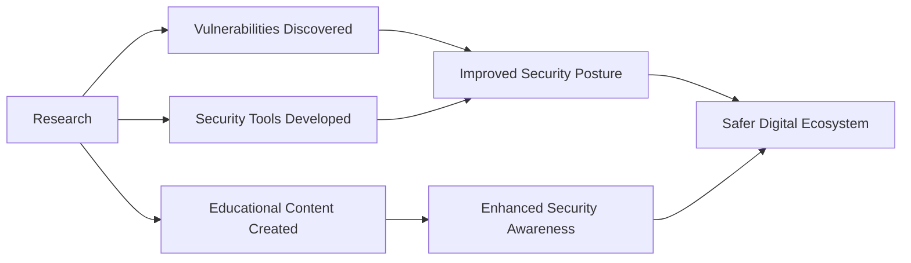

  
  
  # **SecOpsElite**
  ### *Where Security Meets Excellence*

  
  
  
  
  

  

## 🔒 **About SecOpsElite**

**SecOpsElite** is a premier cybersecurity entity specializing in ethical hacking, bug bounty hunting, and advanced security research. Our mission is to strengthen the digital landscape by identifying vulnerabilities before malicious actors can exploit them and educating the next generation of cybersecurity professionals.

> *"In the realm of cybersecurity, we are not just defenders—we are the strategic architects of impenetrable digital fortresses."*

## 🛡️ **Our Core Focus Areas**

| Domain | Expertise |
|--------|-----------|
| **Vulnerability Assessment** | Comprehensive security audits, penetration testing, and vulnerability discovery |
| **Bug Bounty Services** | Professional bug hunting, program management, and vulnerability disclosure |
| **Security Education** | Training programs, workshops, certification guidance, and hands-on labs |
| **Research & Development** | Zero-day research, exploit development, and security tool creation |
| **Advisory Services** | Strategic security consulting for organizations of all sizes |

## 🔍 **Core Competencies**

```mermaid
graph TD
    A[SecOpsElite] --> B[Penetration Testing]
    A --> C[Bug Bounty Hunting]
    A --> D[Security Research]
    A --> E[Educational Content]
    A --> F[Advisory Services]
    
    B --> B1[Web Applications]
    B --> B2[Mobile Applications]
    B --> B3[Network Infrastructure]
    B --> B4[Cloud Environments]
    
    C --> C1[Vulnerability Discovery]
    C --> C2[Exploit Development]
    C --> C3[Security Reporting]
    
    D --> D1[Zero-day Research]
    D --> D2[Tool Development]
    D --> D3[Security Frameworks]
    
    E --> E1[Training Programs]
    E --> E2[Security Certifications]
    E --> E3[Practical Labs]
    
    F --> F1[Security Strategy]
    F --> F2[Compliance Guidance]
    F --> F3[Incident Response Planning]
```

## 💻 **Technology Stack**

### **Offensive Security Toolkit**

### **Defensive Security Tools**

### **Development & Automation**

## 🌐 **Professional Services**

### **For Organizations**
- **Security Assessments**: Comprehensive evaluations of your security posture
- **Red Team Operations**: Simulated attacks to test defensive capabilities
- **Security Architecture Review**: Evaluation of security design and implementation
- **Compliance Consulting**: Guidance on regulatory requirements and best practices
- **Incident Response Planning**: Development of effective response strategies

### **For Security Professionals**
- **Advanced Training**: Specialized courses in cutting-edge security techniques
- **Certification Preparation**: Structured guidance for industry certifications
- **Mentorship Programs**: One-on-one guidance from experienced security experts
- **Career Development**: Strategic planning for cybersecurity career advancement
- **Community Resources**: Access to exclusive tools, guides, and research papers

## 📚 **Knowledge Repository**

Explore our extensive collection of security resources:

| Resource | Description | Link |
|----------|-------------|------|
| **Vulnerability Database** | Curated collection of discovered vulnerabilities | [View Repository](https://github.com/secopselite/vulnerability-database) |
| **Security Tools** | Custom-developed security testing tools | [View Repository](https://github.com/secopselite/security-tools) |
| **Training Materials** | Comprehensive education resources | [View Repository](https://github.com/secopselite/security-training) |
| **CTF Writeups** | Detailed solutions to capture-the-flag challenges | [View Repository](https://github.com/secopselite/ctf-writeups) |
| **Research Papers** | Published security research and findings | [View Repository](https://github.com/secopselite/security-research) |

## 🏆 **Notable Achievements**

- **Discovered critical vulnerabilities** in systems used by Fortune 500 companies
- **Recognized by major tech companies** through bug bounty Hall of Fame entries
- **Developed innovative security tools** adopted by thousands of security professionals
- **Published groundbreaking research** on emerging attack vectors
- **Trained hundreds of cybersecurity professionals** who now lead security teams worldwide

## 📈 **Industry Impact**

## 🔮 **Our Vision**

At SecOpsElite, we envision a digital landscape where security is not an afterthought but an integral part of every system and process. We are committed to pushing the boundaries of cybersecurity through innovative research, practical education, and professional services that make a tangible difference.

## 🤝 **Connect & Collaborate**

We're always open to collaboration with like-minded security professionals and organizations. Whether you're interested in our services, looking to contribute to our research, or seeking mentorship in your security journey, we'd love to hear from you.

  
  
  
  
  

---

  
  
  ### **Security is not a product, but a process. - Bruce Schneier**

